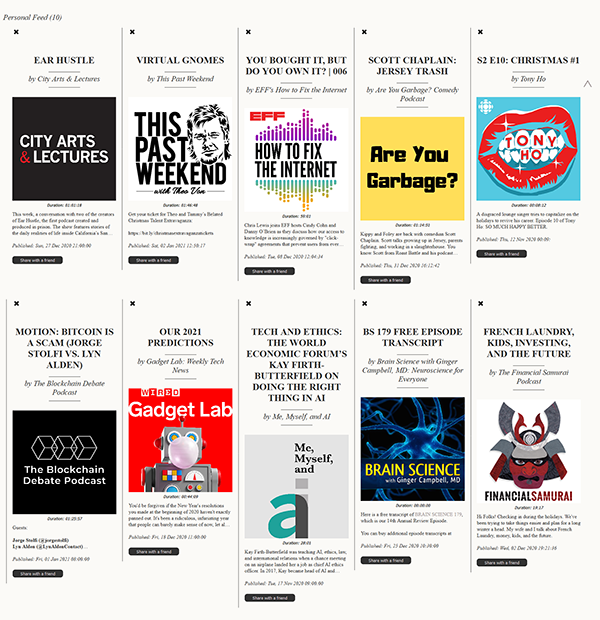

# TailoredFlow 
Your personal decentralized RSS podcast aggregator

## Overview

TailoredFlow is a single-page app that uses RSS (Really Simple Syndication) and peer-to-peer communication together with decentralized storage to serve as a podcast player and discovery app.

It utilizes WebTorrent and WebRTC in the browser for peer discovery, and IPFS to store top trending podcasts. Your personal feed is stored directly and only in your browser.

You can click and add any podcast from the trending feed or add your favorite podcast via RSS link. Every time you add a podcast via Add RSS Url button - other users will be able to see it in trending feed. It will instantly appear in your personal feed ready to play.

Every user has his own unique #ID that he can copy and privatly share with any other user to send him a particular podcast or the whole feed! The sharing feature is session-based, which means - to directly share a feed or a podcast to someone, you both have to be online at the same time.

Every time you refresh a page a new ID is generated for you, to protect your privacy and avoid tracking.

Trending feed is auto-updated by other peers in real-time.

Not only is TailoredFlow single page app, but a single HTML file at that one! This means you can download it and use it localy (it does not require hosting).

No login, no database, no server. It's all a single, newspaper-like page.

It works on Firefox, Chrome, Safari (mobile too!) - even when you lock your phone :)

**Shipped version:** 1.0

## Screenshots

## Demo

https://tailoredflow.today

#### Supported architectures

* Web browser - Firefox, Chrome, Safari, Brave ...
* Mobile browsers same

## Links

---

